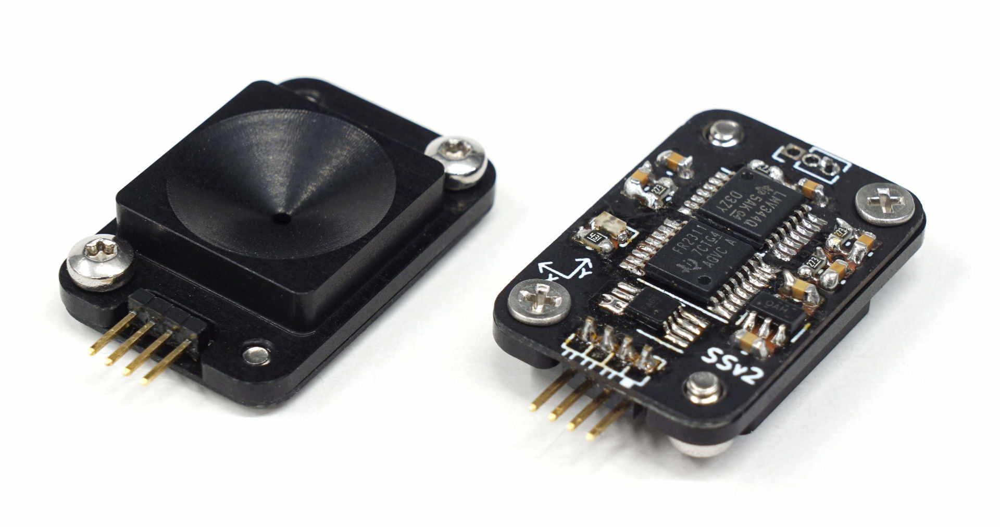

# Foresail-1 PSS Sun Sensor

This repository contains the public available design files for the PSS sun sensor designed for the Foresail-1 Cubesat.

The general characteristics of sensor design are:
- Dimensions: 24 mm × 16 mm × 6 mm
- Mass: 4 grams
- Panel mountedable into 14x14 mm hole with two M2 screws.
- Electrical connection by soldering on the panel PCB or by harness.
- FOV: ~100 degrees, resolution: 0.13°, accuracy: ±1°
- Refresh rate up to 100 Hz. (Sampling time: 4 ms + communication overhead)
- Can provide following data products:
    - Raw current measurements
    - Point & intensity measurements
    - Sun vector & intensity measurements
    - Angles & intensity measurements
- I2C digital serial interface (hardware version 3)
- RS-485 digital interface (hardware version 4)
- Low power consumption < 4 mW when active
- Nominal operating voltage: 3.6 - 3.8V: Can be extened easily to 2.0 – 5.5 V.

## Documentation

- [FS1 ADCS PSS Sun Sensor Design Document](docs/FS1p_ADCS_PSS_Sun_Sensor_Design_Document.pdf)
- [Version 3 schematic (I2C variant)](v3/pss_v3_schema.pdf)
- [Version 3 firmware source code](v3/fw)
- [Version 4 schematic (RS-485 variant)](v4/pss_v4_schema.pdf)
- [Version 4 firmware source code](v4/fw)
- [Calibration and test tools for PC](calibration)
- [Mechanical design files](mechanical)

## Licence

The design is licenced under [CERN Open Hardware Licence Version 2](LICENCE) 